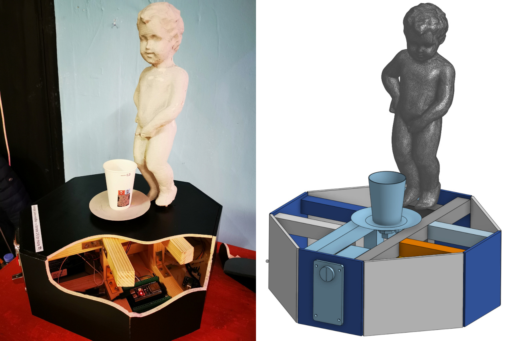

# Le Petit Julien: Pissed Off - Interactive Mechatronic Cocktail Art Installation

Interactive exhibit of "Petit Julien" ("Manneken Piss"), urinating drinks.

> This little bastard takes care of some some yellow-screwdriver revenge for 
> you. Admit it: you’ve already dreamt of that at least once.
> [Roboexotica 2025](https://roboexotica.at/?exhibition2025)

Roboexotica 2025: [Photos of exhibition](https://www.esel.at/de/album/roboexotica-2025--031s2bxzYJqxJ13hXJkv2q)

The statue is made of plaster, sized 2/3 of the original. It features a liquid
pumping system, a digital scale and a coin acceptor to donate coins. It is controlled by a ESP-32 and C code.

## Technical brief
```
Plaster cast in a 1.5 mm PLA 3D-printed mold, 6 mm plywood box, 8 mm aluminum tube,
2.5 mm silicone rubber hose, ESP32-S3 microcontroller, 492 lines of C code, LM2596
DC-DC voltage converter, 1 kg load cell with strain gauge, HX711 24-bit A/D converter,
DG600F coin acceptor, 12 V peristaltic pump with controller board, 1-channel relay,
PLA 3D-printed weighing pan, 10 L water canister.
```

See /esp-32-s3 subfolder for microcontroller source code.



# Pissed Off ESP32-S3 Code

This ESP-32 code controls the following hardware:

- load cell
- peristaltic pump
- coin acceptor

## Loop - wait for donation and cup, then dispense a cocktail; repeat

- count coins, measure load
- INSERT_COIN: when coins reach price for a defined duration AND load = empty cup:
  - set drink size based on donation (hint: does only work if donating first, then placing cup)
  - switch on peristaltic pump
  - state -> DISPENSING
- DISPENSING: 
  - measure dispensed
  - when load = full cup OR timeout (empty supply) OR load = 0 (someone took cup or cup fell):
    - switch off peristaltic pump
    - state -> TAKE_CUP or INSERT_COIN if someone took the cup
- TAKE_CUP: when load = empty:
    - reset coins (only here when full cocktail has been dispensed, otherwise credits remain valid)
    - tare
    - state -> INSERT_COIN

## Connect to ESP32

powershell:
```
usbipd list
usbipd attach --wsl --auto-attach --busid 10-2
```

wsl:
```
ls /dev
```
look for ttyACM0 (on my machine) and set in esp-idf config

## Ideas and Todo

- measuring the weight when placing a cup takes place only once. this might lead
  to wrong weight when users move the cup around and press.
- nive to have: count all donated coins across the session and store overall coint coin, preferably by day + have a way to output the amount
  - could use NVS to store an int 32 per day, marked by key name, e.g. key = "coins_2025-11-23", value = 4000 meaning EUR 40,-
  - would have to use NVS iterator to get all coins donated OR simply try to get keys for certain dates
  
# 3D CAD

Files in STL format sit in /3d_cad and have been created in OnShape. The mold is split in half and then again split in 4 parts for printing.

(c) 2025, Christian Schüler, hello@christianschueler.at
